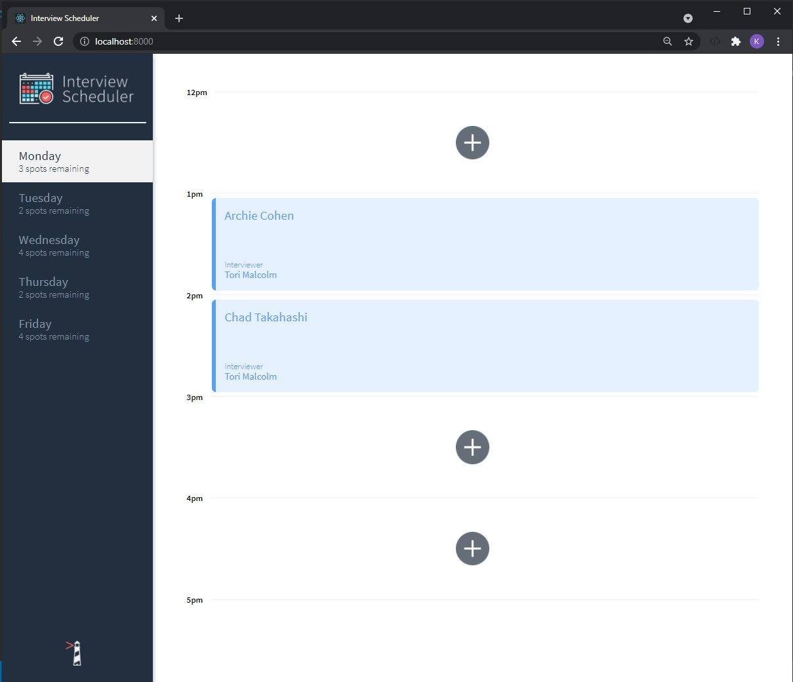
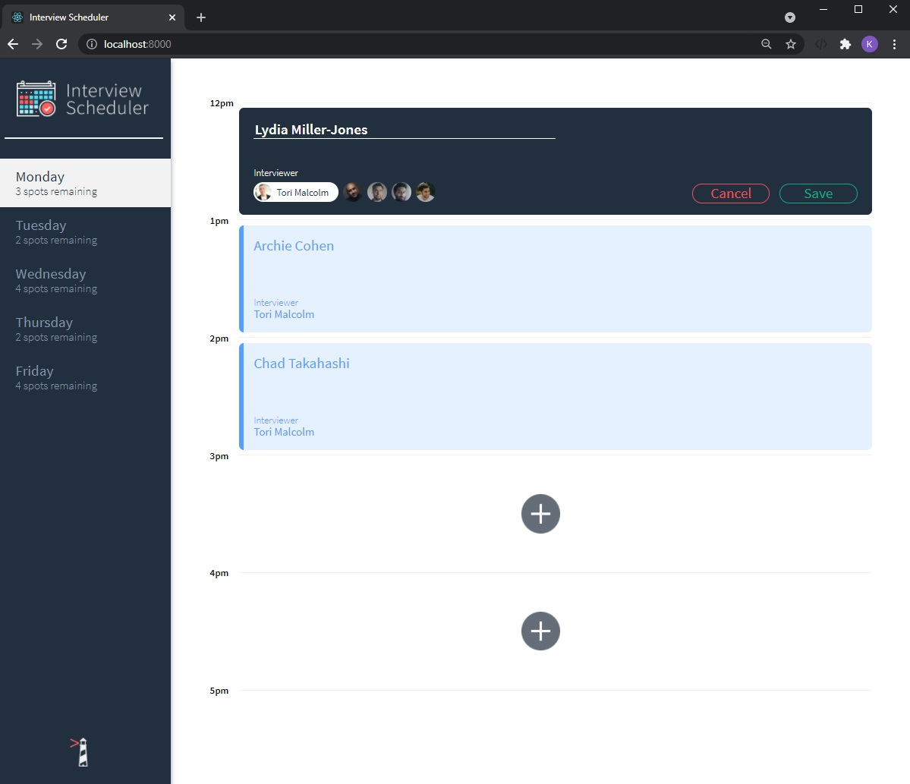
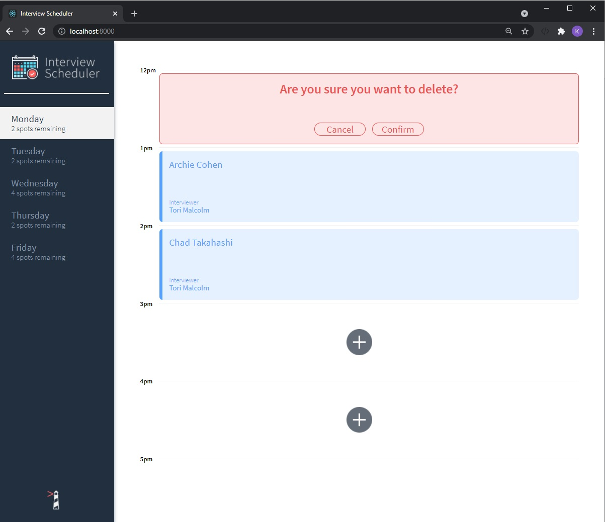
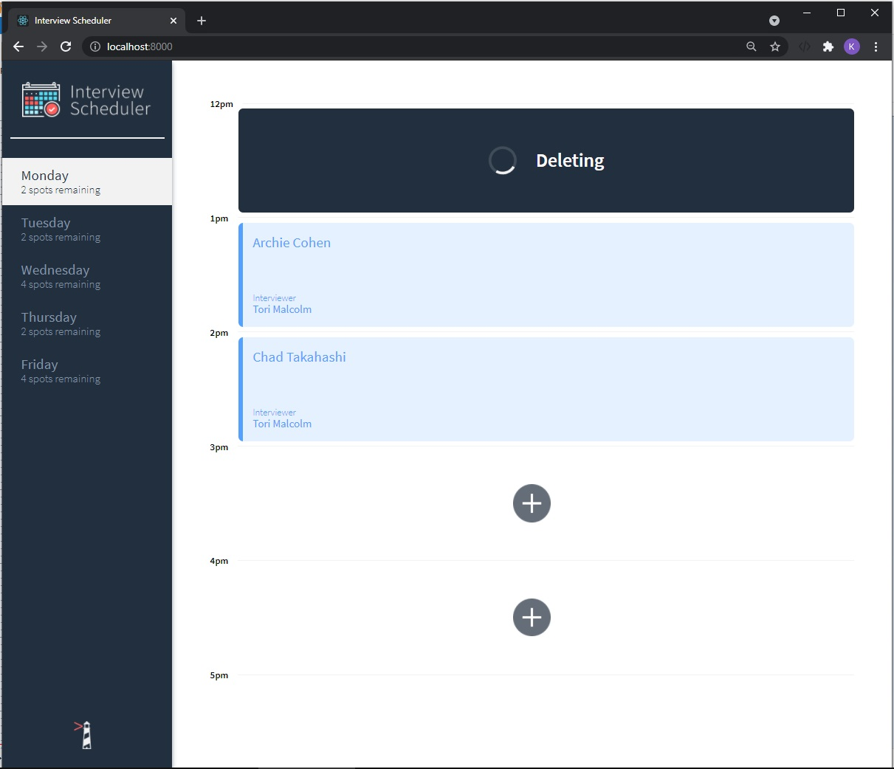

# Interview Scheduler
A single page app for booking appointments, build with React, tested with jest and cypress.

# Screenshots

Main page

Form for creating an appointment

Editing form for an appointment is the same as creating

Saving indicator

Confirmation of delete
Deleting indicator



## Setup

Install dependencies with `npm install`.

## Running Webpack Development Server

```sh
npm start
```

## Running Jest Test Framework

```sh
npm test
```

## Running Storybook Visual Testbed

```sh
npm run storybook
```
